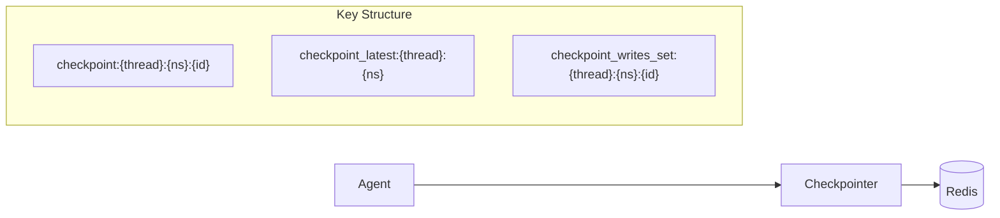
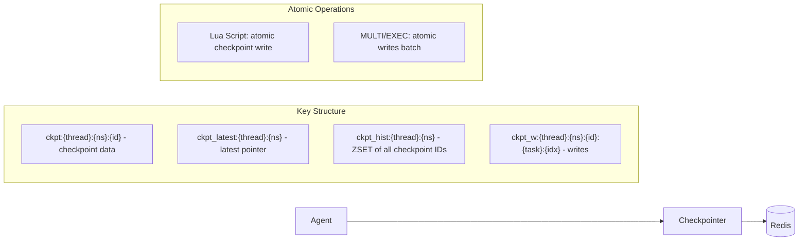
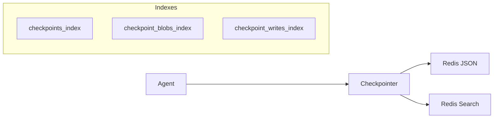
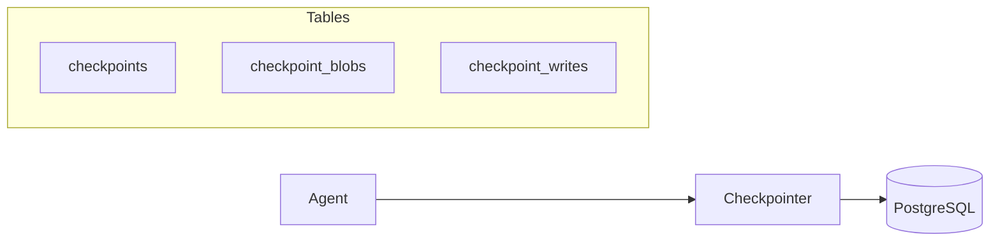
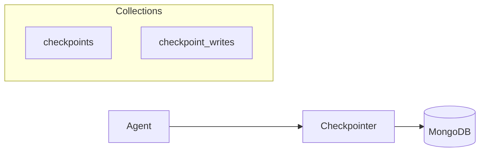
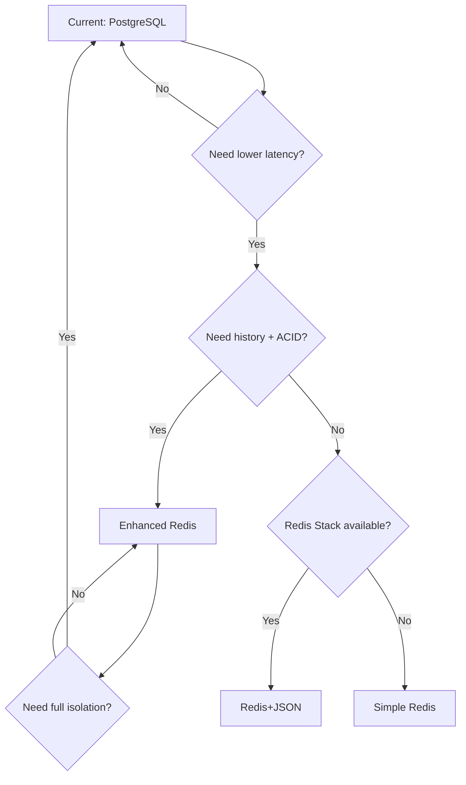

# TRD: Checkpointer Implementation Comparison

## Overview

This document compares different checkpointing backends for LangGraph agents, analyzing trade-offs between simplicity, performance, features, and operational requirements.

## Implementations Compared

| Backend | Package | Module Requirements | Complexity |
|---------|---------|---------------------|------------|
| Simple Redis | `simple_redis_checkpointer.py` | None (vanilla Redis) | Low |
| **Enhanced Redis** | `enhanced_redis_checkpointer.py` | None (vanilla Redis) | Medium |
| Redis + JSON | `langgraph-checkpoint-redis` | RedisJSON, RediSearch | High |
| PostgreSQL | `langgraph-checkpoint-postgres` | None | Medium |
| MongoDB | Custom implementation | None | Medium |

---

## 1. Simple Redis (Our Implementation)

### Architecture



### Implementation Details

- **Storage**: JSON serialized to string, binary data base64-encoded
- **Indexing**: None - uses key patterns and "latest pointer" keys
- **Write tracking**: Redis Sets to track write keys per checkpoint

### Pros

| Advantage | Description |
|-----------|-------------|
| **No module dependencies** | Works with vanilla Redis (AWS ElastiCache, etc.) |
| **Simple deployment** | `docker run redis:latest` - no special configuration |
| **Low latency** | Simple GET/SET operations, no query parsing |
| **Easy debugging** | Keys are human-readable, data is JSON |
| **Cost effective** | Any Redis tier works, no Redis Stack pricing |

### Cons

| Disadvantage | Description |
|--------------|-------------|
| **No checkpoint history** | `alist()` only returns latest checkpoint |
| **No complex queries** | Cannot filter by metadata, step, source |
| **Key scanning for cleanup** | `adelete_thread()` requires pattern matching |
| **Base64 overhead** | ~33% storage increase for binary data |
| **No atomic transactions** | Pipeline without MULTI/EXEC |

### Best For

- Development and testing
- Simple single-turn agents
- Environments without Redis Stack (ElastiCache, etc.)
- Cost-sensitive deployments

---

## 1b. Enhanced Redis (Our Implementation with History + ACID)

### Architecture



### Implementation Details

- **Storage**: JSON serialized to string, binary data base64-encoded
- **History**: Sorted Set (ZSET) tracks all checkpoint IDs by timestamp
- **ACID**: Lua scripts for atomic checkpoint writes, MULTI/EXEC for write batches
- **Filtering**: Denormalized `source` and `step` fields for metadata queries

### Pros

| Advantage | Description |
|-----------|-------------|
| **Full checkpoint history** | `alist()` with pagination, limit, before filter |
| **ACID-like guarantees** | Lua scripts ensure all-or-nothing writes |
| **Filter by metadata** | Query by source, step fields |
| **No module dependencies** | Works with vanilla Redis (ElastiCache) |
| **Atomic delete** | Thread cleanup in single transaction |

### Cons

| Disadvantage | Description |
|--------------|-------------|
| **Lua script complexity** | Debugging is harder than simple commands |
| **No true isolation** | Redis transactions are atomic but not isolated |
| **Base64 overhead** | ~33% storage increase for binary data |
| **Memory for history** | ZSET grows with checkpoint count |

### ACID Guarantees Explained

| Property | Support | How |
|----------|---------|-----|
| **Atomicity** | ✅ Full | Lua scripts execute atomically |
| **Consistency** | ✅ Full | All keys updated together or none |
| **Isolation** | ⚠️ Partial | No read-your-writes within script |
| **Durability** | ⚠️ Configurable | Depends on Redis persistence (AOF/RDB) |

### Best For

- Production multi-turn agents on ElastiCache
- Applications needing checkpoint history
- When Redis Stack is not available
- Balance of features and simplicity

---

## 2. Redis + JSON Module (Official)

### Architecture



### Implementation Details

- **Storage**: Native Redis JSON (nested document support)
- **Indexing**: RediSearch FT.SEARCH for all queries
- **Write tracking**: Sorted sets with registry pattern

### Pros

| Advantage | Description |
|-----------|-------------|
| **Full checkpoint history** | `alist()` with filtering, pagination, sorting |
| **Complex queries** | Filter by source, step, metadata fields |
| **Efficient partial updates** | `JSON.MERGE` for atomic updates |
| **Native JSON operations** | No serialization overhead |
| **TTL on nested paths** | Fine-grained expiration control |

### Cons

| Disadvantage | Description |
|--------------|-------------|
| **Module dependencies** | Requires RedisJSON + RediSearch |
| **Redis Stack only** | Not available on ElastiCache, basic Redis |
| **Complex setup** | Index creation, schema management |
| **Higher cost** | Redis Stack/Enterprise pricing |
| **Query complexity** | FT.SEARCH syntax learning curve |

### Best For

- Production multi-turn agents
- Applications needing checkpoint history
- Teams with Redis Stack expertise
- Complex workflow resumption

---

## 3. PostgreSQL

### Architecture



### Implementation Details

- **Storage**: JSONB columns for structured data, BYTEA for blobs
- **Indexing**: B-tree indexes on thread_id, checkpoint_id
- **Connection**: Async via psycopg3, connection pooling

### Pros

| Advantage | Description |
|-----------|-------------|
| **ACID transactions** | Full consistency guarantees |
| **Rich querying** | SQL with JSONB operators |
| **Mature ecosystem** | pgAdmin, monitoring, backups |
| **No special modules** | Standard PostgreSQL works |
| **Familiar to teams** | Most common database choice |
| **Cloud availability** | RDS, Cloud SQL, Aurora, etc. |

### Cons

| Disadvantage | Description |
|--------------|-------------|
| **Higher latency** | ~2-5ms vs ~0.5ms for Redis |
| **Connection overhead** | Pool management, connection limits |
| **Schema migrations** | DDL changes require planning |
| **Scaling complexity** | Read replicas, sharding needed at scale |
| **Resource usage** | Higher CPU/memory than Redis |

### Best For

- Production deployments with existing PostgreSQL
- Applications requiring ACID guarantees
- Teams with SQL expertise
- Audit/compliance requirements

---

## 4. MongoDB

### Architecture



### Implementation Details

- **Storage**: BSON documents (native binary JSON)
- **Indexing**: Compound indexes on thread_id, checkpoint_ns
- **Connection**: Motor async driver

### Pros

| Advantage | Description |
|-----------|-------------|
| **Schema flexibility** | No migrations for structure changes |
| **Native BSON** | Efficient binary storage |
| **Document model** | Natural fit for checkpoint structure |
| **Horizontal scaling** | Sharding built-in |
| **TTL indexes** | Automatic document expiration |
| **Cloud availability** | Atlas, DocumentDB |

### Cons

| Disadvantage | Description |
|--------------|-------------|
| **No official package** | Custom implementation required |
| **Eventual consistency** | Default read concern is local |
| **Memory usage** | WiredTiger cache requirements |
| **Operational complexity** | Replica sets, config servers |
| **Cost at scale** | Atlas pricing can be high |

### Best For

- Document-oriented applications
- Teams with MongoDB expertise
- Applications already using MongoDB
- Global distribution needs (Atlas)

---

## Performance Comparison

### Latency (p50, single checkpoint operation)

| Operation | Simple Redis | Enhanced Redis | Redis+JSON | PostgreSQL | MongoDB |
|-----------|-------------|----------------|------------|------------|---------|
| `aput` | ~0.5ms | ~0.6ms | ~0.8ms | ~3ms | ~2ms |
| `aget_tuple` | ~0.3ms | ~0.4ms | ~1.2ms | ~2ms | ~1.5ms |
| `alist` (10 items) | N/A | ~1.5ms | ~2ms | ~5ms | ~3ms |

### Storage Efficiency

| Backend | 100 checkpoints | Notes |
|---------|-----------------|-------|
| Simple Redis | ~2MB | Base64 overhead |
| Enhanced Redis | ~2.1MB | Base64 + ZSET overhead |
| Redis+JSON | ~1.5MB | Native JSON |
| PostgreSQL | ~1.8MB | JSONB compression |
| MongoDB | ~1.6MB | BSON encoding |

---

## Feature Matrix

| Feature | Simple Redis | Enhanced Redis | Redis+JSON | PostgreSQL | MongoDB |
|---------|-------------|----------------|------------|------------|---------|
| Checkpoint history | ❌ | ✅ | ✅ | ✅ | ✅ |
| Filter by metadata | ❌ | ✅ | ✅ | ✅ | ✅ |
| TTL support | ✅ | ✅ | ✅ | ❌ (manual) | ✅ |
| ACID transactions | ❌ | ⚠️ (Lua scripts) | ❌ | ✅ | ⚠️ (w:majority) |
| Horizontal scaling | ✅ (Cluster) | ✅ (Cluster) | ✅ (Cluster) | ⚠️ (complex) | ✅ |
| Cloud managed | ✅ | ✅ | ❌ (Stack only) | ✅ | ✅ |
| Official package | ❌ | ❌ | ✅ | ✅ | ❌ |
| Isolation | ❌ | ⚠️ | ❌ | ✅ | ⚠️ |

---

## Decision Matrix

### Choose Enhanced Redis when:

- [x] Need checkpoint history and filtering
- [x] Using AWS ElastiCache or basic Redis
- [x] Need ACID-like guarantees (atomicity, consistency)
- [x] Production multi-turn agents
- [x] Redis Stack is not available
- [x] Lower latency than PostgreSQL needed

### Choose Simple Redis when:

- [x] Using AWS ElastiCache or basic Redis
- [x] Single-turn or stateless agents
- [x] Development/testing environment
- [x] Cost is primary concern
- [x] Team unfamiliar with Redis Stack

### Choose Redis+JSON when:

- [x] Need checkpoint history and filtering
- [x] Can deploy Redis Stack
- [x] Low latency is critical
- [x] Team has Redis expertise
- [x] Complex workflow resumption needed

### Choose PostgreSQL when:

- [x] Already have PostgreSQL infrastructure
- [x] ACID guarantees required
- [x] Team has SQL expertise
- [x] Compliance/audit requirements
- [x] Moderate scale (<1000 req/s)

### Choose MongoDB when:

- [x] Already have MongoDB infrastructure
- [x] Need schema flexibility
- [x] Global distribution required
- [x] Team has MongoDB expertise
- [x] Document model fits well

---

## Recommendation

**Primary: PostgreSQL** (current implementation)
- Already integrated and tested
- Full ACID guarantees for conversation state
- Works with existing infrastructure

**Secondary: Enhanced Redis** (for high-performance scenarios)
- Production-ready with history and ACID-like guarantees
- ~5x lower latency than PostgreSQL
- Works on ElastiCache (no Redis Stack needed)
- Best for high-throughput, latency-sensitive workloads

**Tertiary: Simple Redis** (for development)
- Quick local testing
- Single-turn agents
- Minimal setup required

**Not Recommended: Redis+JSON**
- Redis Stack not available on ElastiCache
- Additional operational complexity
- Enhanced Redis provides similar features without modules

---

## Migration Path



## Implementation Files

| Implementation | File | Lines of Code |
|---------------|------|---------------|
| Simple Redis | `tests/simple_redis_checkpointer.py` | ~200 |
| Enhanced Redis | `tests/enhanced_redis_checkpointer.py` | ~400 |

### Usage Example (Enhanced Redis)

```python
from tests.enhanced_redis_checkpointer import EnhancedAsyncRedisSaver

async with EnhancedAsyncRedisSaver.from_conn_string(
    "redis://localhost:6379",
    ttl_seconds=3600,
) as checkpointer:
    agent = create_deep_agent(
        tools=[...],
        checkpointer=checkpointer,
        enable_filesystem=False,
        enable_todos=True,
    )

    # Checkpoint history is available
    async for cp in checkpointer.alist(config, limit=10):
        print(f"Checkpoint: {cp.checkpoint['id']}")

    # Filter by metadata
    async for cp in checkpointer.alist(config, filter={"source": "loop"}):
        print(f"Loop checkpoint: {cp.checkpoint['id']}")
```

---

## References

- [langgraph-checkpoint-postgres](https://github.com/langchain-ai/langgraph/tree/main/libs/checkpoint-postgres)
- [langgraph-checkpoint-redis](https://github.com/langchain-ai/langgraph/tree/main/libs/checkpoint-redis)
- [Redis Stack Documentation](https://redis.io/docs/stack/)
- [PostgreSQL JSONB](https://www.postgresql.org/docs/current/datatype-json.html)
